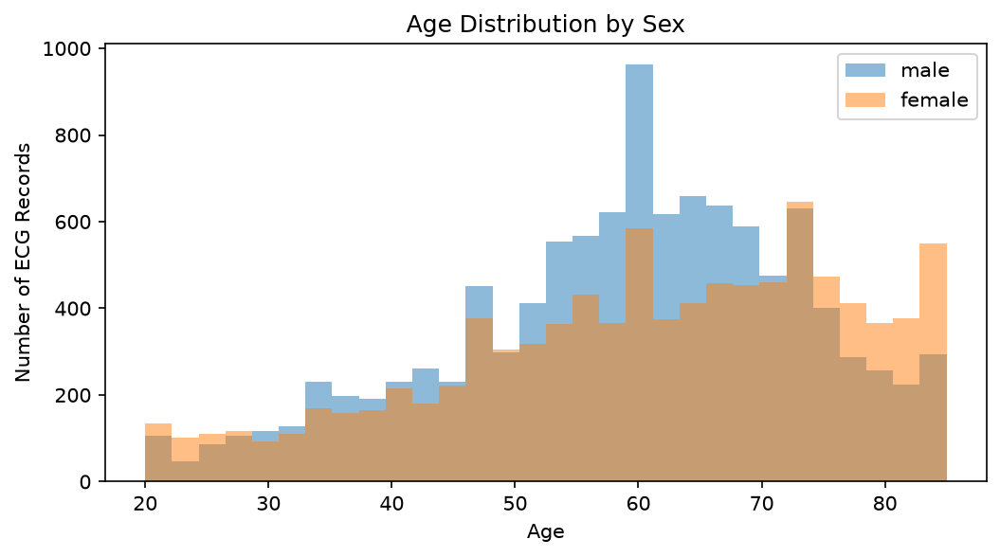
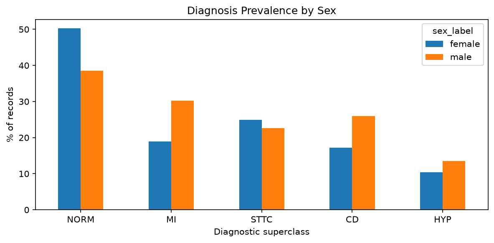
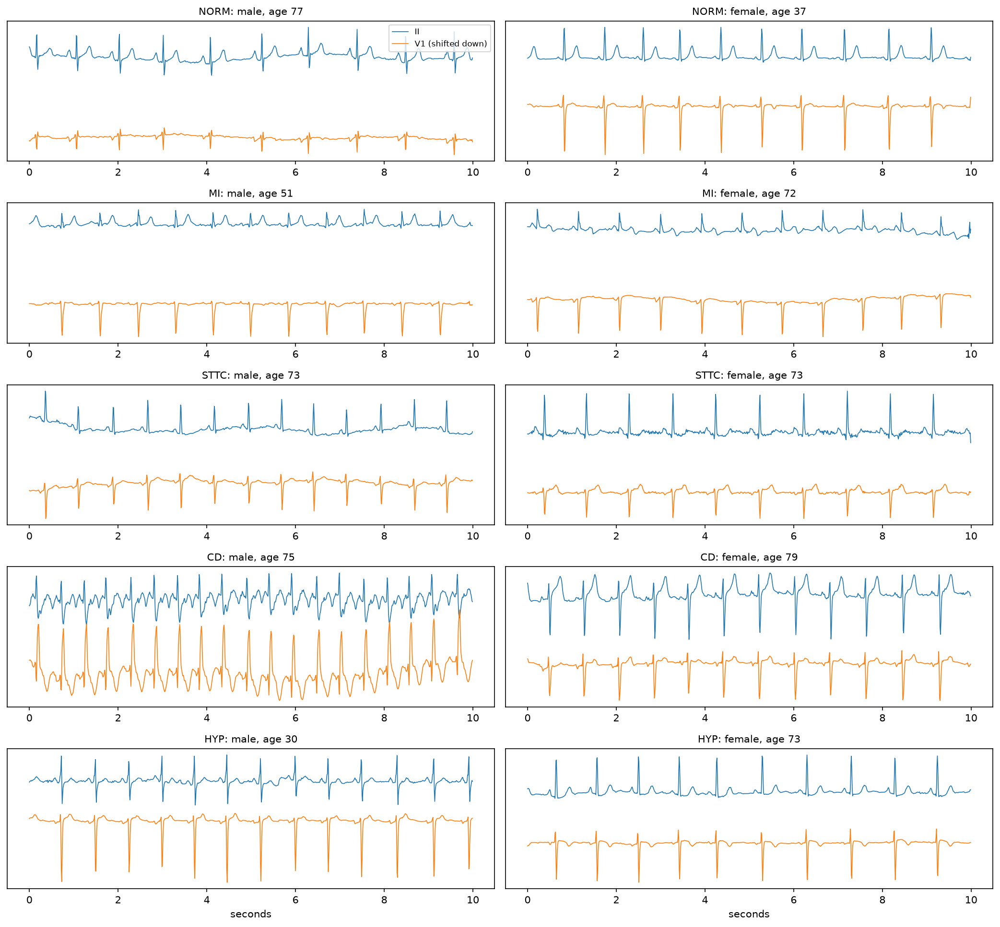
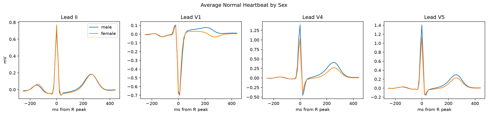
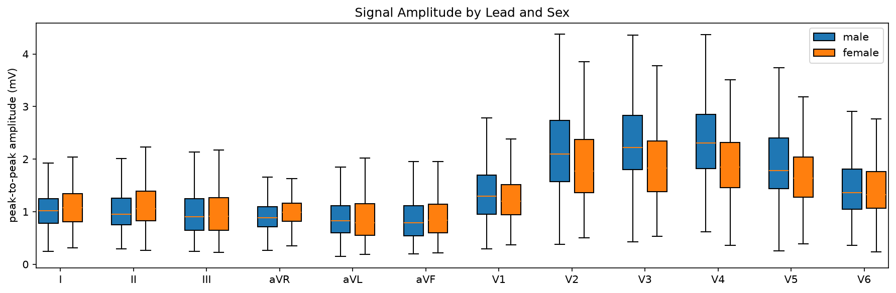
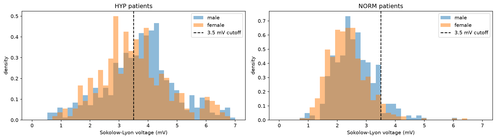
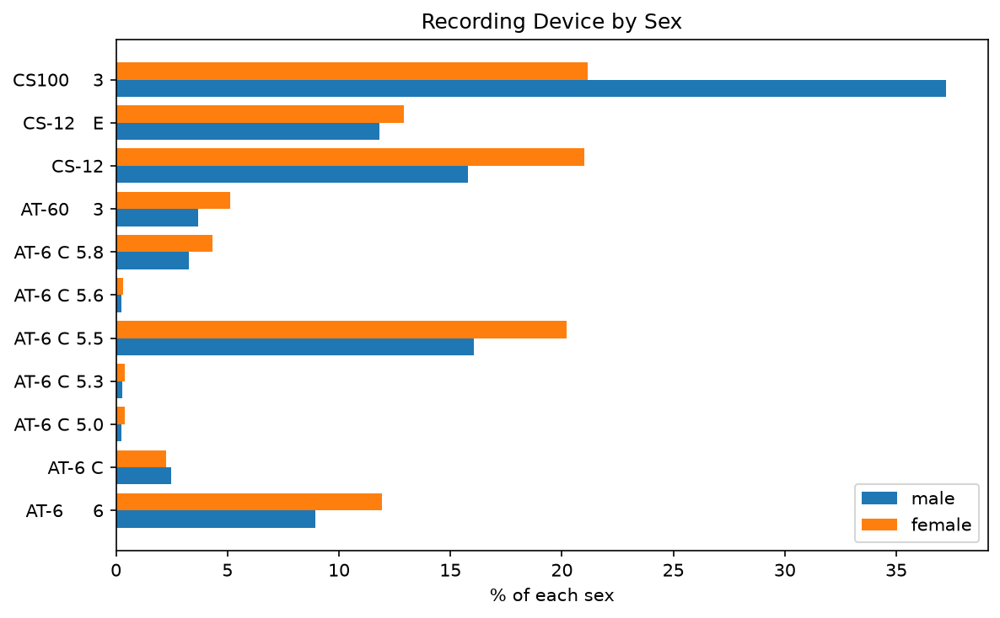
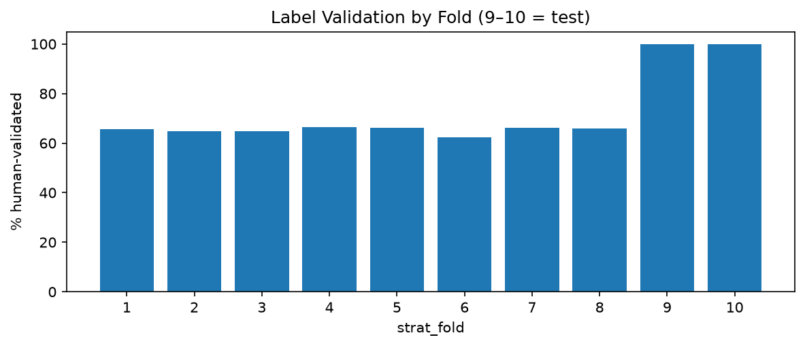

# Check-in 1 — DSAN 6600

**Sex-Matched vs. More Data: What Closes the Subgroup Gap in ECG Classification?**

Chloe Jones · Olivia Semien · Due Sept 30, 2026

---

## 1. Problem framing + scope

**Task.** Multi-label classification of 12-lead ECGs into PTB-XL's five diagnostic superclasses (NORM, MI, STTC, CD, HYP). We hold the model fixed and vary the *training data* — how much of it, and how much comes from women — then measure performance on male and female test sets separately.

**Questions.**

- **1 — Trade-off.** At a fixed budget of N samples, is female performance better served by all-female data or by a mixed set? We try to state an exchange rate: how many mixed samples equal one sex-matched one.
- **2 — Does scale fix it?** The default answer to a subgroup gap is "collect more data." We train across a ladder of sizes and check whether the male–female gap actually shrinks. A flat line means more data doesn't fix it.
- **3 — Why?** If a gap survives, is it a different learned representation (needs a separate model) or a mis-set threshold (needs recalibration)? Tested by recalibrating on women only.

**Success criteria.** Success means we can quantify how much sex-matching vs. sample size affects the AUROC gap between men and women, with the neural model beating the logistic regression baseline.

**Scope.** Open dataset, no credentialing. 100 Hz signals train in minutes per run. Grid bounded at ~45 runs. Work splits cleanly into a data track and a modeling track.

**Why it matters to us.** Women's health is understudied in both medicine and data science, and cardiology is a clear example. Heart disease in women is often underdiagnosed, and many diagnostic standards were built mostly on data from men. If ECG models learn the same bias, they could end up performing worse for the patients who are already underserved. As women in data science, we want to understand whether this happens and what can reduce it. This is a semester project, but the skills we build here could one day support more impactful work.

---

## 2. Dataset access + documentation

**PTB-XL v1.0.3** — PhysioNet. 21,799 clinical 12-lead ECGs from 18,869 patients, 10 seconds each, at 100 Hz and 500 Hz.

| | |
|---|---|
| **Source** | https://physionet.org/content/ptb-xl/1.0.3/ |
| **Size** | 1.7 GB zipped / 3.0 GB unzipped; we use the 100 Hz subset |
| **License** | Creative Commons Attribution 4.0 — open access, no credentialing |
| **Reading** | `wfdb` Python package |

**Why it fits.** `sex` and `age` on every record — the two variables our design needs. `strat_fold` gives 10 stratified folds that keep each patient's records together, so patient-level separation is handled for us. Folds 9–10 received human validation and are our test set.

**Access.**

```bash
wget -r -N -c -np https://physionet.org/files/ptb-xl/1.0.3/
pip install wfdb
```

Data is gitignored. The repo carries code and the metadata CSV only, so anyone can clone and reproduce the pull in one line.

---

## 3. Data audit / EDA

Notebooks: [`01_data_cleaning.ipynb`](notebooks/01_data_cleaning.ipynb) (cleaning, labels, test sets, basic EDA) → [`02_eda_signals.ipynb`](notebooks/02_eda_signals.ipynb) (signal-level EDA). Run in order; the first saves the cleaned data the second loads.

### Cleaning

- **Age:** ages above 89 are stored as 300 for privacy. We keep ages 20–85 (following Steinbrinker et al., 2025), which removes the 300s and pediatric records: **21,799 → 20,370 records**.
- **Sex:** `0` = male, `1` = female. Cleaned cohort is **10,870 male / 9,500 female (46.6% female)**.
- **Labels:** SCP codes mapped to the 5 superclasses via `scp_statements.csv`. 378 records have only rhythm/form codes and no diagnostic label; kept for EDA, dropped before training.
- **Test set:** folds 9–10, **4,048 records (2,177 male, 1,871 female)**, all human-validated.

### Who is in the data



Women are older (median 63 vs 60) with a wider spread (SD 16.1 vs 14.2).



| | NORM | MI | STTC | CD | HYP |
|---|---|---|---|---|---|
| Male (% of 10,870) | 38.5 | 30.3 | 22.6 | 26.0 | 13.5 |
| Female (% of 9,500) | 50.3 | 19.0 | 24.9 | 17.2 | 10.4 |

Base rates differ sharply: half of women's ECGs are normal vs 39% of men's, and men have far more MI (30% vs 19%) and CD (26% vs 17%). An unmatched male-vs-female comparison would mostly measure these base rates, which is why training sets will be matched on age and class prevalence.

### Signals





Averaging ~1,000 normal ECGs, lead II is nearly identical by sex, but in the chest leads (V4, V5) the female R peak is clearly shorter (~1.05 vs ~1.4 mV) and the T wave lower; V1 shows a flatter ST/T segment in women. Sex differences sit in the chest leads and the ST/T region, which overlaps the features used to diagnose MI and STTC.



Women's median resting heart rate is 70.6 bpm vs 65.9 for men.

### Biases and failure modes

**Label bias from male-derived criteria.** The Sokolow-Lyon voltage rule flags hypertrophy above 3.5 mV. Among patients *diagnosed* with HYP, only **49.0% of women** exceed it vs **61.5% of men**.



PTB-XL labels come from ECG reads, not imaging, so women whose hypertrophy the criteria miss may be labeled as not having it. A model trained on these labels can learn that bias, and our test set can't detect errors the labels share. We report performance as agreement with expert ECG reads, not ground-truth disease.

**Device confound.** The CS100 device recorded **37.2% of men but 21.2% of women**. A model could learn device artifacts that correlate with sex, so any sex gap must be checked against device.



**Label quality.** Folds 1–8 are only 62–66% human-validated; about a third of training labels are unreviewed machine reports.



**Noise.** Static noise affects ~15% of records; baseline drift, burst noise, and extra beats each affect 2–10%. Rates are similar by sex.

**Other.** Class imbalance (NORM 8,964 vs HYP 2,460) makes accuracy uninformative. The `report` column (German/Swedish free text) and fields like `heart_axis` and `infarction_stadium` are written from the ECG by cardiologists, so they would leak the answer and are excluded as inputs.

---

## 4. Evaluation plan

Train on folds 1–7, validate on fold 8, test on folds 9–10. Test sets are fixed before anything else and never touched.

**Metrics.** Macro AUROC and AUPRC, reported separately for male and female test sets. Not accuracy — class imbalance makes it meaningless.

- **Gap metric:** male-minus-female AUROC, plotted against training size. This is the answer to RQ2.
- **Calibration:** reliability curves and Expected Calibration Error per subgroup. A model can match AUROC across groups while under-predicting risk in one of them at a fixed threshold — that's the failure mode that reaches patients.
- **Per-class breakdown:** the trade-off likely differs between MI and conduction disturbance; a pooled average would hide it.
- **Age stratification:** ECG sex signal is reported to weaken with age, predicting a larger gap in younger patients. We test it directly.

**Noise.** Three seeds per cell, varying both the data subset and weight initialization. Everything reported as means with error bars.

---

## 5. Initial direction

**Primary (Check-in 2).** A 1D convolutional network over the raw 12-lead signal — residual blocks, roughly 5–10 layers, global average pooling, sigmoid outputs for multi-label. This family is the standard for PTB-XL and fast enough at 100 Hz to make ~45 runs realistic.

Architecture stays **fixed** across every cell of the main grid. The independent variables are training size and composition; changing the model would confound them.

**Stretch arm — transfer learning.** RQ2 asks whether more data closes the gap. Pretraining is more data, borrowed rather than collected. If scale within PTB-XL doesn't close the gap, transfer might. We plan a reduced slice comparing three regimes:

| Regime | What trains |
|---|---|
| From scratch | Everything (our main grid) |
| Frozen | Pretrained encoder fixed, new head only |
| Fine-tuned | Pretrained encoder updated end to end |

Run at a subset of training sizes, not the full grid, so the primary comparison stays clean. The encoder would come from a publicly available self-supervised ECG model — these are largely 1D vision-transformer masked autoencoders, which is how a transformer enters the design.


**Non-neural probe.** Logistic regression on simple extracted features, to establish a floor the neural model has to beat.

---

## 6. Video

~5 min, linked [HERE]()
---


## 7. AI Disclosure

We used AI as an assistant on this check-in. Specifically, it helped with:

- **Code:** drafting and debugging the data cleaning, label mapping, and plotting code 
- **Error checking:** Ran code by ai for error checking and fixing
- **Explanation:** explaining ECG terminology (leads, QRS, ST segment, hypertrophy voltage criteria) and what the plots show.
- **Writing:** drafting parts of this README, including the EDA summary and chart takeaways, from our notebook results.

All code was run by us on the real data, and all numbers in this document come from our notebook outputs. We reviewed and edited the AI-assisted code and text, and we are responsible for the final content.


## 8. Citations

## References

Wagner, P., Strodthoff, N., Bousseljot, R.-D., Kreiseler, D., Lunze, F. I., Samek, W., & Schaeffter, T. (2020). PTB-XL, a large publicly available electrocardiography dataset. *Scientific Data*. https://doi.org/10.1038/s41597-020-0495-6

Wagner, P., et al. (2022). PTB-XL, a large publicly available electrocardiography dataset (version 1.0.3). *PhysioNet*. RRID:SCR_007345. https://doi.org/10.13026/kfzx-aw45

Pollard, T., et al. (2026). PhysioNet as a global platform for biomedical research. *Nature Health*. https://doi.org/10.1038/s44360-026-00096-z

